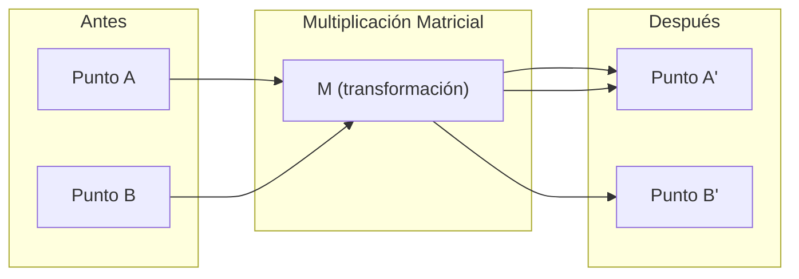
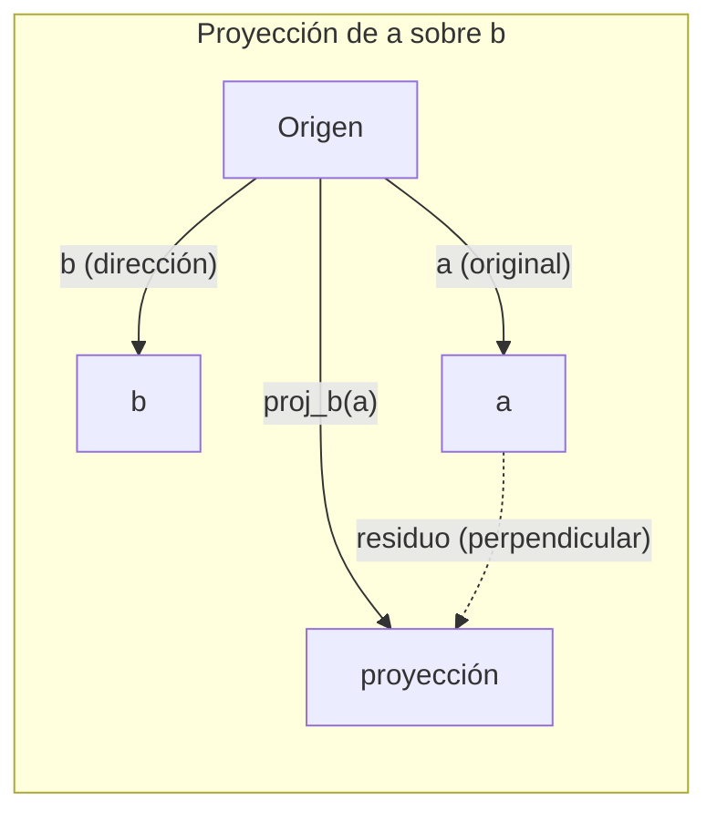

# L01 — Linear Algebra Intuition

> Todo modelo de AI es solo álgebra matricial con sombrero elegante.

**Tipo:** Learn
**Lenguajes:** Python, Julia
**Prerrequisitos:** Fase 0
**Tiempo:** ~60 minutos

---

## Objetivos de aprendizaje

- Implementar operaciones de vectores y matrices (suma, producto punto, multiplicación matricial) desde cero en Python
- Explicar geométricamente qué hacen el producto punto, la proyección y el proceso de Gram-Schmidt
- Determinar independencia lineal, rango y base de un conjunto de vectores usando reducción de filas
- Conectar conceptos de álgebra lineal con sus aplicaciones en AI: embeddings, attention scores, y LoRA

---

## El Problema

Abre cualquier paper de ML. En la primera página verás vectores, matrices, productos punto y transformaciones. Sin intuición de álgebra lineal, son solo símbolos. Con ella, puedes ver lo que una red neuronal está haciendo en realidad: mover puntos en el espacio.

No necesitas ser matemático. Necesitas ver qué significan estas operaciones geométricamente, y luego programarlas tú mismo.

---

## El Concepto

### Los Vectores son Puntos (y Direcciones)

Un vector es solo una lista de números. Pero esos números significan algo: son coordenadas en el espacio.

**Vector 2D [3, 2]:**

| x | y | Punto |
|---|---|-------|
| 3 | 2 | El vector apunta desde el origen (0,0) hasta (3, 2) en el plano |

El vector tiene magnitud $\sqrt{3^2 + 2^2} = \sqrt{13}$ y apunta hacia arriba y a la derecha.

En AI, los vectores representan todo:
- Una palabra → un vector de 768 números (su "significado" en el espacio de embeddings)
- Una imagen → un vector de millones de valores de píxeles
- Un usuario → un vector de preferencias

### Las Matrices son Transformaciones

Una matriz transforma un vector en otro. Puede rotar, escalar, estirar o proyectar.



En AI, las matrices **son** el modelo:
- Pesos de una red neuronal → matrices que transforman el input en output
- Attention scores → matrices que deciden en qué enfocarse
- Embeddings → matrices que mapean palabras a vectores

### El Producto Punto Mide Similitud

El producto punto de dos vectores te dice qué tan similares son.

$$a \cdot b = a_1 b_1 + a_2 b_2 + \cdots + a_n b_n$$

| Caso | Condición | Significado |
|------|-----------|-------------|
| Misma dirección | $a \cdot b > 0$ | similares |
| Perpendiculares | $a \cdot b = 0$ | no relacionados |
| Dirección opuesta | $a \cdot b < 0$ | disimilares |

Así funcionan literalmente los motores de búsqueda, sistemas de recomendación y RAG: encontrar vectores con alto producto punto.

### Independencia Lineal

Los vectores son linealmente independientes si ninguno del conjunto se puede escribir como combinación de los demás. Si v1, v2, v3 son independientes, abarcan un espacio 3D. Si uno es combinación de los otros, solo abarcan un plano.

**Por qué importa en AI:** tu matriz de features debe tener columnas linealmente independientes. Si dos features están perfectamente correlacionadas (linealmente dependientes), el modelo no puede distinguir sus efectos. Esto causa multicolinealidad en regresión — la matriz de pesos se vuelve inestable.

**Ejemplo concreto:**

$$v_1 = [1, 0, 0], \quad v_2 = [0, 1, 0], \quad v_3 = [2, 1, 0] \; \leftarrow v_3 = 2v_1 + v_2 \text{ (¡dependiente!)}$$

$v_1$ y $v_2$ son independientes. Pero $v_3 = 2v_1 + v_2$, así que $\{v_1, v_2, v_3\}$ es un conjunto dependiente. Los tres vectores están en el plano xy — sin importar cómo los combines, nunca llegarás a [0, 0, 1].

Si en un dataset $\text{feature}_3 = 2 \cdot \text{feature}_1 + \text{feature}_2$, agregar $\text{feature}_3$ no da información nueva al modelo. Peor aún: hace las ecuaciones normales singulares — no hay solución única para los pesos.

### Base y Rango

Una **base** es el conjunto mínimo de vectores linealmente independientes que abarcan todo el espacio. El número de vectores de la base es la dimensión del espacio.

La base estándar para 3D es {[1,0,0], [0,1,0], [0,0,1]}. Pero cualquier tres vectores independientes en 3D forman una base válida. La elección de base es una elección de sistema de coordenadas.

**Rango de una matriz** = número de columnas (o filas) linealmente independientes.

| Situación | Rango | Qué significa para ML |
|-----------|-------|----------------------|
| Rango completo | Máximo | Solución mínimo-cuadrados única. Modelo bien condicionado. |
| Rango deficiente | Menor que el máximo | Features redundantes. Infinitas soluciones de pesos. Necesita regularización. |
| Rango 1 | 1 | Cada columna es copia escalada de un vector. Todos los datos en una línea. |
| Casi rango-deficiente | Numéricamente bajo | Mal condicionado. Pequeño ruido en input → cambios grandes en output. |

### Proyección

Proyectar el vector $\mathbf{a}$ sobre el vector $\mathbf{b}$ da la componente de $\mathbf{a}$ en la dirección de $\mathbf{b}$:

$$\text{proj}_\mathbf{b}(\mathbf{a}) = \frac{\mathbf{a} \cdot \mathbf{b}}{\mathbf{b} \cdot \mathbf{b}} \, \mathbf{b}$$

El residuo $(\mathbf{a} - \text{proj}_\mathbf{b}(\mathbf{a}))$ es perpendicular a $\mathbf{b}$. Esta descomposición ortogonal es la base del ajuste de mínimos cuadrados.

La proyección está en todas partes en ML:
- La regresión lineal minimiza la distancia desde las observaciones al espacio columna — la solución ES una proyección
- PCA proyecta los datos en las direcciones de máxima varianza
- La atención en transformers calcula proyecciones de queries sobre keys



**Ejemplo:** $\mathbf{a} = [3, 4]$, $\mathbf{b} = [1, 0]$

$$\text{proj}_\mathbf{b}(\mathbf{a}) = \frac{3 \cdot 1 + 4 \cdot 0}{1 \cdot 1 + 0 \cdot 0} \cdot [1, 0] = 3 \cdot [1, 0] = [3, 0]$$

La proyección elimina la componente y. Esto es reducción de dimensionalidad en su forma más simple.

### Proceso de Gram-Schmidt

Convierte cualquier conjunto de vectores independientes en una base ortonormal. Ortonormal significa que cada vector tiene longitud 1 y cada par es perpendicular.

El algoritmo:
1. Toma el primer vector, normalízalo
2. Toma el segundo vector, resta su proyección sobre el primero, normaliza
3. Toma el tercer vector, resta sus proyecciones sobre todos los vectores anteriores, normaliza
4. Repite para los vectores restantes

$$\mathbf{u}_1 = \frac{\mathbf{v}_1}{\|\mathbf{v}_1\|}$$

$$\mathbf{w}_2 = \mathbf{v}_2 - (\mathbf{v}_2 \cdot \mathbf{u}_1)\,\mathbf{u}_1 \qquad \mathbf{u}_2 = \frac{\mathbf{w}_2}{\|\mathbf{w}_2\|}$$

$$\mathbf{w}_3 = \mathbf{v}_3 - (\mathbf{v}_3 \cdot \mathbf{u}_1)\,\mathbf{u}_1 - (\mathbf{v}_3 \cdot \mathbf{u}_2)\,\mathbf{u}_2 \qquad \mathbf{u}_3 = \frac{\mathbf{w}_3}{\|\mathbf{w}_3\|}$$

Entrada: $v_1, v_2, v_3, \ldots$ (linealmente independientes) → Salida: $u_1, u_2, u_3, \ldots$ (base ortonormal)

Así es como funciona la descomposición QR internamente. Q es la base ortonormal, R captura los coeficientes de proyección. La descomposición QR se usa en:
- Resolver sistemas lineales (más estable que la eliminación gaussiana)
- Calcular autovalores (algoritmo QR)
- Regresión por mínimos cuadrados (el método numérico estándar)

---

## Construyéndolo

### Paso 1: Vectores desde cero (Python)

```python
class Vector:
    def __init__(self, components):
        self.components = list(components)
        self.dim = len(self.components)

    def __add__(self, other):
        return Vector([a + b for a, b in zip(self.components, other.components)])

    def __sub__(self, other):
        return Vector([a - b for a, b in zip(self.components, other.components)])

    def dot(self, other):
        return sum(a * b for a, b in zip(self.components, other.components))

    def magnitude(self):
        return sum(x**2 for x in self.components) ** 0.5

    def normalize(self):
        mag = self.magnitude()
        return Vector([x / mag for x in self.components])

    def cosine_similarity(self, other):
        return self.dot(other) / (self.magnitude() * other.magnitude())

    def __repr__(self):
        return f"Vector({self.components})"


a = Vector([1, 2, 3])
b = Vector([4, 5, 6])

print(f"a + b = {a + b}")
print(f"a · b = {a.dot(b)}")
print(f"|a| = {a.magnitude():.4f}")
print(f"cosine similarity = {a.cosine_similarity(b):.4f}")
```

### Paso 2: Matrices desde cero (Python)

```python
class Matrix:
    def __init__(self, rows):
        self.rows = [list(row) for row in rows]
        self.shape = (len(self.rows), len(self.rows[0]))

    def __matmul__(self, other):
        if isinstance(other, Vector):
            return Vector([
                sum(self.rows[i][j] * other.components[j] for j in range(self.shape[1]))
                for i in range(self.shape[0])
            ])
        rows = []
        for i in range(self.shape[0]):
            row = []
            for j in range(other.shape[1]):
                row.append(sum(
                    self.rows[i][k] * other.rows[k][j]
                    for k in range(self.shape[1])
                ))
            rows.append(row)
        return Matrix(rows)

    def transpose(self):
        return Matrix([
            [self.rows[j][i] for j in range(self.shape[0])]
            for i in range(self.shape[1])
        ])

    def __repr__(self):
        return f"Matrix({self.rows})"


rotation_90 = Matrix([[0, -1], [1, 0]])
point = Vector([3, 1])

rotated = rotation_90 @ point
print(f"Original: {point}")
print(f"Rotado 90°: {rotated}")
```

### Paso 3: Por qué esto importa para AI

```python
import random

random.seed(42)
weights = Matrix([[random.gauss(0, 0.1) for _ in range(3)] for _ in range(2)])
input_vector = Vector([1.0, 0.5, -0.3])

output = weights @ input_vector
print(f"Input (3D): {input_vector}")
print(f"Output (2D): {output}")
print("Esto es lo que hace una capa de red neuronal: multiplicación matricial.")
```

### Paso 4: NumPy — lo que usarás en la práctica

```python
import numpy as np

a = np.array([1, 2, 3], dtype=float)
b = np.array([4, 5, 6], dtype=float)

print(f"a + b = {a + b}")
print(f"a · b = {np.dot(a, b)}")
print(f"|a| = {np.linalg.norm(a):.4f}")
print(f"cosine = {np.dot(a, b) / (np.linalg.norm(a) * np.linalg.norm(b)):.4f}")

W = np.random.randn(2, 3) * 0.1
x = np.array([1.0, 0.5, -0.3])
print(f"Wx = {W @ x}")
```

### Paso 5: Rango, Proyección y QR con NumPy

```python
import numpy as np

A = np.array([[1, 2], [2, 4]])
print(f"Rango: {np.linalg.matrix_rank(A)}")

a = np.array([3, 4])
b = np.array([1, 0])
proj = (np.dot(a, b) / np.dot(b, b)) * b
print(f"Proyección de {a} sobre {b}: {proj}")

Q, R = np.linalg.qr(np.random.randn(3, 3))
print(f"Q es ortogonal: {np.allclose(Q @ Q.T, np.eye(3))}")
print(f"R es triangular superior: {np.allclose(R, np.triu(R))}")
```

### Paso 6: PyTorch — Tensores son Vectores con Autodiff

```python
import torch

x = torch.randn(3, requires_grad=True)
y = torch.tensor([1.0, 0.0, 0.0])

similarity = torch.dot(x, y)
similarity.backward()

print(f"x = {x.data}")
print(f"y = {y.data}")
print(f"producto punto = {similarity.item():.4f}")
print(f"d(dot)/dx = {x.grad}")
```

El gradiente del producto punto con respecto a x es simplemente y. PyTorch lo computó automáticamente. Toda operación en una red neuronal está construida de operaciones como esta — multiplicaciones matriciales, productos punto, proyecciones — y autodiff rastrea los gradientes a través de todas ellas.

---

## Ejercicios

1. Implementa `Vector.angle_between(other)` que retorne el ángulo en grados entre dos vectores
2. Crea una matriz de escalado 2D que duplique la coordenada x y triplique la y, luego aplícala al vector [1, 1]
3. Dado 5 vectores aleatorios tipo "word" (dimensión 50), encuentra los dos más similares usando cosine similarity
4. Verifica que el output de Gram-Schmidt es verdaderamente ortonormal: comprueba que cada par tiene producto punto 0 y cada vector tiene magnitud 1
5. Crea una matriz 3×3 con rango 2. Verifica usando `np.linalg.matrix_rank()`. Explica qué objeto geométrico abarcan las columnas.
6. Proyecta el vector [1, 2, 3] sobre [1, 1, 1]. ¿Qué representa el resultado geométricamente?

---

## Conexiones con AI moderno

| Concepto | Dónde aparece |
|---------|--------------|
| Producto punto | Attention scores en transformers, cosine similarity en RAG |
| Multiplicación matricial | Cada capa de red neuronal, cada transformación lineal |
| Independencia lineal | Selección de features, evitar multicolinealidad |
| Rango | Determinar si un sistema es solucionable, **LoRA** (low-rank adaptation) |
| Proyección | Regresión lineal (proyección sobre el espacio columna), PCA |
| Gram-Schmidt / QR | Solvers numéricos, cómputo de autovalores |
| Base ortonormal | Cómputo numérico estable, whitening transforms |

**LoRA merece mención especial.** Afina LLMs grandes descomponiendo las actualizaciones de pesos en matrices de bajo rango. En lugar de actualizar una matriz de pesos 4096×4096 (16M parámetros), LoRA actualiza dos matrices de tamaño 4096×16 y 16×4096 (131K parámetros). La restricción de rango-16 significa que LoRA asume que la actualización de pesos vive en un subespacio de 16 dimensiones del espacio completo de 4096 dimensiones. Eso es álgebra lineal haciendo trabajo real.

---

## Términos clave

| Término | Lo que dice la gente | Lo que realmente significa |
|---------|---------------------|--------------------------|
| Vector | "Una flecha" | Lista de números que representa un punto o dirección en espacio n-dimensional |
| Matriz | "Una tabla de números" | Transformación que mapea vectores de un espacio a otro |
| Producto punto | "Multiplica y suma" | Medida de qué tan alineados están dos vectores — el núcleo de búsqueda por similitud |
| Embedding | "Magia de AI" | Vector que representa el significado de algo (palabra, imagen, usuario) |
| Independencia lineal | "No se solapan" | Ningún vector del conjunto se puede escribir como combinación de los demás |
| Rango | "Cuántas dimensiones" | Número de columnas (o filas) linealmente independientes de una matriz |
| Proyección | "La sombra" | Componente de un vector en la dirección de otro |
| Base | "Los ejes de coordenadas" | Conjunto mínimo de vectores independientes que abarcan el espacio |
| Ortonormal | "Vectores unitarios perpendiculares" | Vectores mutuamente perpendiculares con longitud 1 cada uno |
