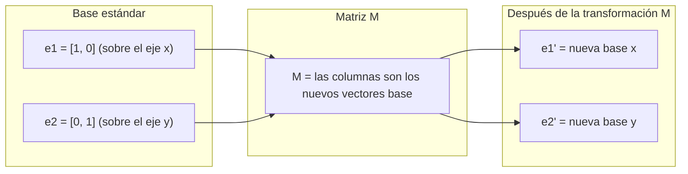
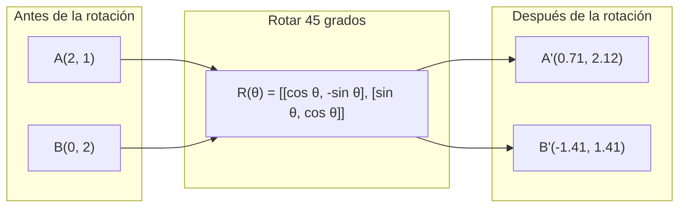
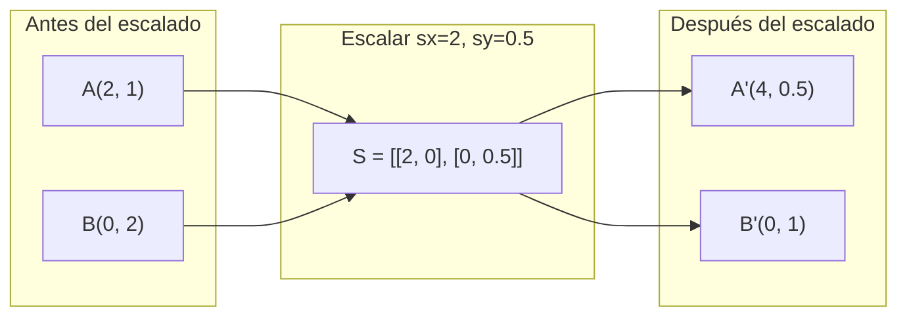
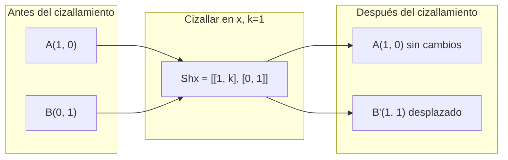
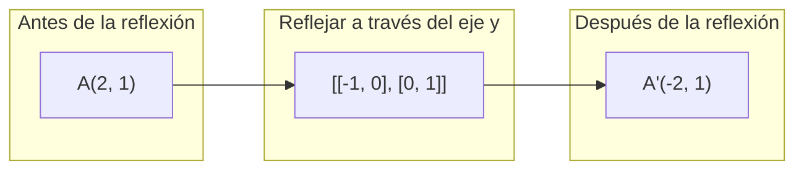
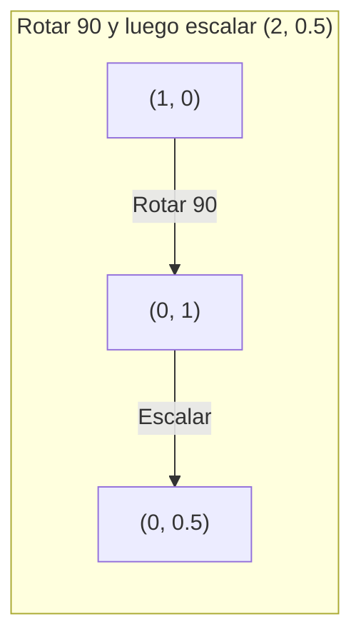
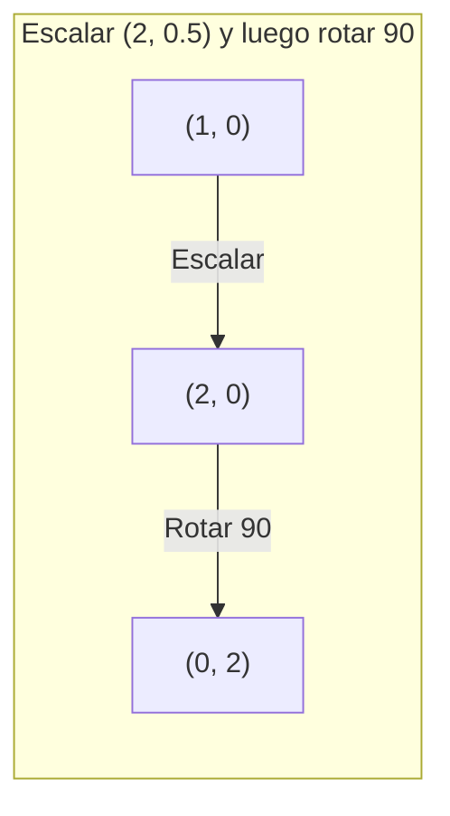

# Transformaciones de Matrices

> Una matriz es una máquina que remodela el espacio. Aprende qué le hace a cada punto, y entenderás la transformación completa.

**Tipo:** Construcción
**Lenguajes:** Python, Julia
**Prerrequisitos:** Fase 1, Lecciones 01-02 (Intuición de Álgebra Lineal, Vectores y Operaciones de Matrices)
**Tiempo:** ~75 minutos

## Objetivos de aprendizaje

- Construir matrices de rotación, escalado, cizallamiento (*shear*) y reflexión, y aplicarlas a puntos en 2D y 3D
- Componer múltiples transformaciones mediante multiplicación de matrices y verificar que el orden importa
- Calcular autovalores (*eigenvalues*) y autovectores (*eigenvectors*) de matrices $2\times2$ a partir de la ecuación característica
- Explicar por qué los autovalores determinan las direcciones de PCA, la estabilidad de las RNN y el comportamiento del *clustering* espectral

## El problema

Lees sobre PCA y ves "encuentra los autovectores de la matriz de covarianza". Lees sobre estabilidad de modelos y ves "verifica si todos los autovalores tienen magnitud menor que 1". Lees sobre aumento de datos (*data augmentation*) y ves "aplica una rotación aleatoria". Nada de esto tiene sentido hasta que entiendes qué le hacen las matrices al espacio, geométricamente.

Las matrices no son solo cuadrículas de números. Son máquinas espaciales. Una matriz de rotación hace girar los puntos. Una matriz de escalado los estira. Una matriz de cizallamiento los inclina. Cada transformación que una red neuronal aplica a los datos es una de estas operaciones, o una composición de ellas. Esta lección hace esas operaciones concretas.

## El concepto

### Las transformaciones como matrices

Toda transformación lineal en 2D puede escribirse como una matriz $2\times2$. La matriz te dice exactamente dónde terminan los vectores base $[1, 0]$ y $[0, 1]$. Todo lo demás se sigue de ahí.



### Rotación

Una rotación 2D por un ángulo $\theta$ mantiene intactas las distancias y los ángulos. Mueve cada punto a lo largo de un arco circular.



En 3D, rotas alrededor de un eje. Cada eje tiene su propia matriz de rotación:

```
Rz(theta) = | cos  -sin  0 |     Rota alrededor del eje z
            | sin   cos  0 |     (el plano x-y gira, z se mantiene)
            |  0     0   1 |

Rx(theta) = | 1   0     0    |   Rota alrededor del eje x
            | 0  cos  -sin   |   (el plano y-z gira, x se mantiene)
            | 0  sin   cos   |

Ry(theta) = |  cos  0  sin |     Rota alrededor del eje y
            |   0   1   0  |     (el plano x-z gira, y se mantiene)
            | -sin  0  cos |
```

### Escalado

El escalado estira o comprime a lo largo de cada eje de forma independiente.



### Cizallamiento (*Shear*)

El cizallamiento inclina un eje mientras mantiene fijo el otro. Convierte rectángulos en paralelogramos.



Matrices de cizallamiento:
- `Shx = [[1, k], [0, 1]]` desplaza x en $k \cdot y$
- `Shy = [[1, 0], [k, 1]]` desplaza y en $k \cdot x$

### Reflexión

La reflexión refleja los puntos a través de un eje o línea.



Matrices de reflexión:
- Reflejar a través del eje y: `[[-1, 0], [0, 1]]`
- Reflejar a través del eje x: `[[1, 0], [0, -1]]`

### Composición: encadenar transformaciones

Aplicar la transformación A y luego B es lo mismo que multiplicar sus matrices: `resultado = B @ A @ punto`. El orden importa. Rotar y luego escalar da resultados distintos que escalar y luego rotar.



Compuesto: $S @ R = \begin{pmatrix} 0 & -2 \\ 0.5 & 0 \end{pmatrix}$



Compuesto: $R @ S = \begin{pmatrix} 0 & -0.5 \\ 2 & 0 \end{pmatrix}$

Resultados distintos. La multiplicación de matrices no es conmutativa.

### Autovalores y autovectores (*Eigenvalues* y *eigenvectors*)

La mayoría de los vectores cambian de dirección cuando una matriz los transforma. Los autovectores son especiales: la matriz solo los escala, nunca los rota. El factor de escala es el autovalor.

```
A @ v = lambda * v

v es el autovector (la dirección que sobrevive)
lambda es el autovalor (cuánto se estira)

Ejemplo: A = | 2  1 |
             | 1  2 |

Autovector [1, 1] con autovalor 3:
  A @ [1,1] = [3, 3] = 3 * [1, 1]     (misma dirección, escalada por 3)

Autovector [1, -1] con autovalor 1:
  A @ [1,-1] = [1, -1] = 1 * [1, -1]  (misma dirección, sin cambios)
```

La matriz estira el espacio 3 veces a lo largo de $[1, 1]$ y mantiene $[1, -1]$ sin cambios. Cualquier otra dirección es una mezcla de estas dos.

### Descomposición en autovalores (*Eigendecomposition*)

Si una matriz tiene $n$ autovectores linealmente independientes, puede descomponerse:

```
A = V @ D @ V^(-1)

V = matriz cuyas columnas son los autovectores
D = matriz diagonal de autovalores
V^(-1) = inversa de V

Esto dice: rota hacia las coordenadas de los autovectores, escala a lo largo de cada eje, y rota de vuelta.
```

### Por qué importan los autovalores

**PCA.** Los autovectores de la matriz de covarianza son las componentes principales. Los autovalores te dicen cuánta varianza captura cada componente. Ordénalos por autovalor, conserva los $k$ principales, y tienes reducción de dimensionalidad.

**Estabilidad.** En redes recurrentes y sistemas dinámicos, los autovalores con magnitud $> 1$ hacen que las salidas exploten. Una magnitud $< 1$ hace que se desvanezcan. Esto es el problema del gradiente que se desvanece/explota, expresado en una sola oración.

**Métodos espectrales.** Las redes neuronales de grafos usan los autovalores de la matriz de adyacencia. El *clustering* espectral usa los autovalores del Laplaciano. Los autovectores revelan la estructura del grafo.

### El determinante como factor de escalado de volumen

El determinante de una matriz de transformación te dice cuánto escala el área (2D) o el volumen (3D).

```
det = 1:   área preservada (rotación)
det = 2:   área duplicada
det = 0:   el espacio se aplasta a una dimensión menor (singular)
det = -1:  área preservada pero orientación invertida (reflexión)

| det(Rotación) | = 1        (siempre)
| det(Escalado sx, sy) | = sx * sy
| det(Cizallamiento) | = 1           (área preservada)
| det(Reflexión) | = -1     (orientación invertida)
```

## Constrúyelo

### Paso 1: Matrices de transformación desde cero (Python)

```python
import math

def rotation_2d(theta):
    c, s = math.cos(theta), math.sin(theta)
    return [[c, -s], [s, c]]

def scaling_2d(sx, sy):
    return [[sx, 0], [0, sy]]

def shearing_2d(kx, ky):
    return [[1, kx], [ky, 1]]

def reflection_x():
    return [[1, 0], [0, -1]]

def reflection_y():
    return [[-1, 0], [0, 1]]

def mat_vec_mul(matrix, vector):
    return [
        sum(matrix[i][j] * vector[j] for j in range(len(vector)))
        for i in range(len(matrix))
    ]

def mat_mul(a, b):
    rows_a, cols_b = len(a), len(b[0])
    cols_a = len(a[0])
    return [
        [sum(a[i][k] * b[k][j] for k in range(cols_a)) for j in range(cols_b)]
        for i in range(rows_a)
    ]

point = [1.0, 0.0]
angle = math.pi / 4

rotated = mat_vec_mul(rotation_2d(angle), point)
print(f"Rotate (1,0) by 45 deg: ({rotated[0]:.4f}, {rotated[1]:.4f})")

scaled = mat_vec_mul(scaling_2d(2, 3), [1.0, 1.0])
print(f"Scale (1,1) by (2,3): ({scaled[0]:.1f}, {scaled[1]:.1f})")

sheared = mat_vec_mul(shearing_2d(1, 0), [1.0, 1.0])
print(f"Shear (1,1) kx=1: ({sheared[0]:.1f}, {sheared[1]:.1f})")

reflected = mat_vec_mul(reflection_y(), [2.0, 1.0])
print(f"Reflect (2,1) across y: ({reflected[0]:.1f}, {reflected[1]:.1f})")
```

### Paso 2: Composición de transformaciones

```python
R = rotation_2d(math.pi / 2)
S = scaling_2d(2, 0.5)

rotate_then_scale = mat_mul(S, R)
scale_then_rotate = mat_mul(R, S)

point = [1.0, 0.0]
result1 = mat_vec_mul(rotate_then_scale, point)
result2 = mat_vec_mul(scale_then_rotate, point)

print(f"Rotate 90 then scale: ({result1[0]:.2f}, {result1[1]:.2f})")
print(f"Scale then rotate 90: ({result2[0]:.2f}, {result2[1]:.2f})")
print(f"Same? {result1 == result2}")
```

### Paso 3: Autovalores desde cero ($2\times2$)

Para una matriz $2\times2$ `[[a, b], [c, d]]`, los autovalores resuelven la ecuación característica: $\lambda^2 - (a+d)\lambda + (ad - bc) = 0$.

```python
def eigenvalues_2x2(matrix):
    a, b = matrix[0]
    c, d = matrix[1]
    trace = a + d
    det = a * d - b * c
    discriminant = trace ** 2 - 4 * det
    if discriminant < 0:
        real = trace / 2
        imag = (-discriminant) ** 0.5 / 2
        return (complex(real, imag), complex(real, -imag))
    sqrt_disc = discriminant ** 0.5
    return ((trace + sqrt_disc) / 2, (trace - sqrt_disc) / 2)

def eigenvector_2x2(matrix, eigenvalue):
    a, b = matrix[0]
    c, d = matrix[1]
    if abs(b) > 1e-10:
        v = [b, eigenvalue - a]
    elif abs(c) > 1e-10:
        v = [eigenvalue - d, c]
    else:
        if abs(a - eigenvalue) < 1e-10:
            v = [1, 0]
        else:
            v = [0, 1]
    mag = (v[0] ** 2 + v[1] ** 2) ** 0.5
    return [v[0] / mag, v[1] / mag]

A = [[2, 1], [1, 2]]
vals = eigenvalues_2x2(A)
print(f"Matrix: {A}")
print(f"Eigenvalues: {vals[0]:.4f}, {vals[1]:.4f}")

for val in vals:
    vec = eigenvector_2x2(A, val)
    result = mat_vec_mul(A, vec)
    scaled = [val * vec[0], val * vec[1]]
    print(f"  lambda={val:.1f}, v={[round(x,4) for x in vec]}")
    print(f"    A@v = {[round(x,4) for x in result]}")
    print(f"    l*v = {[round(x,4) for x in scaled]}")
```

### Paso 4: El determinante como factor de escalado de volumen

```python
def det_2x2(matrix):
    return matrix[0][0] * matrix[1][1] - matrix[0][1] * matrix[1][0]

print(f"det(rotation 45) = {det_2x2(rotation_2d(math.pi/4)):.4f}")
print(f"det(scale 2,3)   = {det_2x2(scaling_2d(2, 3)):.1f}")
print(f"det(shear kx=1)  = {det_2x2(shearing_2d(1, 0)):.1f}")
print(f"det(reflect y)   = {det_2x2(reflection_y()):.1f}")

singular = [[1, 2], [2, 4]]
print(f"det(singular)     = {det_2x2(singular):.1f}")
print("Singular: columns are proportional, space collapses to a line.")
```

## Úsalo

NumPy maneja todo esto con rutinas optimizadas.

```python
import numpy as np

theta = np.pi / 4
R = np.array([[np.cos(theta), -np.sin(theta)],
              [np.sin(theta),  np.cos(theta)]])

point = np.array([1.0, 0.0])
print(f"Rotate (1,0) by 45 deg: {R @ point}")

S = np.diag([2.0, 3.0])
composed = S @ R
print(f"Scale(2,3) after Rotate(45): {composed @ point}")

A = np.array([[2, 1], [1, 2]], dtype=float)
eigenvalues, eigenvectors = np.linalg.eig(A)
print(f"\nEigenvalues: {eigenvalues}")
print(f"Eigenvectors (columns):\n{eigenvectors}")

for i in range(len(eigenvalues)):
    v = eigenvectors[:, i]
    lam = eigenvalues[i]
    print(f"  A @ v{i} = {A @ v}, lambda * v{i} = {lam * v}")

print(f"\ndet(R) = {np.linalg.det(R):.4f}")
print(f"det(S) = {np.linalg.det(S):.1f}")

B = np.array([[3, 1], [0, 2]], dtype=float)
vals, vecs = np.linalg.eig(B)
D = np.diag(vals)
V = vecs
reconstructed = V @ D @ np.linalg.inv(V)
print(f"\nEigendecomposition A = V @ D @ V^-1:")
print(f"Original:\n{B}")
print(f"Reconstructed:\n{reconstructed}")
```

### Rotaciones 3D con NumPy

```python
def rotation_3d_z(theta):
    c, s = np.cos(theta), np.sin(theta)
    return np.array([[c, -s, 0], [s, c, 0], [0, 0, 1]])

def rotation_3d_x(theta):
    c, s = np.cos(theta), np.sin(theta)
    return np.array([[1, 0, 0], [0, c, -s], [0, s, c]])

point_3d = np.array([1.0, 0.0, 0.0])
rotated_z = rotation_3d_z(np.pi / 2) @ point_3d
rotated_x = rotation_3d_x(np.pi / 2) @ point_3d

print(f"\n3D point: {point_3d}")
print(f"Rotate 90 around z: {np.round(rotated_z, 4)}")
print(f"Rotate 90 around x: {np.round(rotated_x, 4)}")
```

## Envíalo (Ship It)

Esta lección construye las bases geométricas para PCA (Fase 2) y el análisis de pesos de redes neuronales. El código de autovalores/autovectores construido aquí es el mismo algoritmo que impulsa la reducción de dimensionalidad, el *clustering* espectral y el análisis de estabilidad en sistemas de ML en producción.

## Ejercicios

1. Aplica rotación, escalado y cizallamiento a un cuadrado unitario (esquinas en $[0,0]$, $[1,0]$, $[1,1]$, $[0,1]$). Imprime las esquinas transformadas para cada caso. Verifica que la rotación preserva las distancias entre las esquinas.

2. Encuentra los autovalores de la matriz $\begin{pmatrix} 4 & 2 \\ 1 & 3 \end{pmatrix}$ a mano usando la ecuación característica. Luego verifica con tu función desde cero y con NumPy.

3. Crea una composición de tres transformaciones (rotar 30 grados, escalar por $[1.5, 0.8]$, cizallar con $k_x=0.3$) y aplícala a 8 puntos dispuestos en un círculo. Imprime las coordenadas antes y después. Calcula el determinante de la matriz compuesta y verifica que sea igual al producto de los determinantes individuales.

## Términos clave

| Término | Lo que dice la gente | Lo que realmente significa |
|------|----------------|----------------------|
| Matriz de rotación | "Hace girar las cosas" | Una matriz ortogonal que mueve puntos a lo largo de arcos circulares preservando distancias y ángulos. Su determinante siempre es 1. |
| Matriz de escalado | "Hace las cosas más grandes" | Una matriz diagonal que estira o comprime de forma independiente a lo largo de cada eje. Su determinante es el producto de los factores de escala. |
| Matriz de cizallamiento | "Inclina las cosas" | Una matriz que desplaza una coordenada de forma proporcional a otra, convirtiendo rectángulos en paralelogramos. Su determinante es 1. |
| Reflexión | "Refleja las cosas como un espejo" | Una matriz que invierte el espacio a través de un eje o plano. Su determinante es -1. |
| Composición | "Hacer dos cosas" | Multiplicar matrices de transformación para encadenar operaciones. El orden importa: $B @ A$ significa aplicar A primero, luego B. |
| Autovector (*Eigenvector*) | "Una dirección especial" | Una dirección que la matriz solo escala, nunca rota. La huella digital de la transformación. |
| Autovalor (*Eigenvalue*) | "Cuánto se estira" | El factor escalar por el cual la matriz escala su autovector. Puede ser negativo (inversión) o complejo (rotación). |
| Descomposición en autovalores (*Eigendecomposition*) | "Desarmar la matriz" | Escribir una matriz como $V @ D @ V^{-1}$, separándola en sus direcciones y magnitudes fundamentales de escalado. |
| Determinante | "Un solo número de la matriz" | El factor por el cual la transformación escala el área (2D) o el volumen (3D). Cero significa que la transformación es irreversible. |
| Ecuación característica | "De aquí salen los autovalores" | $\det(A - \lambda I) = 0$. El polinomio cuyas raíces son los autovalores. |

## Lecturas adicionales

- [3Blue1Brown: Linear Transformations](https://www.3blue1brown.com/lessons/linear-transformations) -- intuición visual de cómo las matrices remodelan el espacio
- [3Blue1Brown: Eigenvectors and Eigenvalues](https://www.3blue1brown.com/lessons/eigenvalues) -- la mejor explicación visual de lo que significan geométricamente los autovectores
- [MIT 18.06 Lecture 21: Eigenvalues and Eigenvectors](https://ocw.mit.edu/courses/18-06-linear-algebra-spring-2010/) -- el tratamiento clásico de Gilbert Strang
