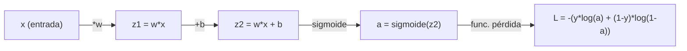
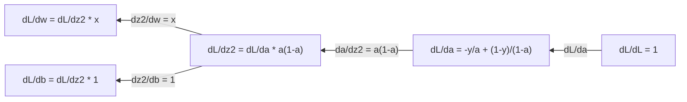
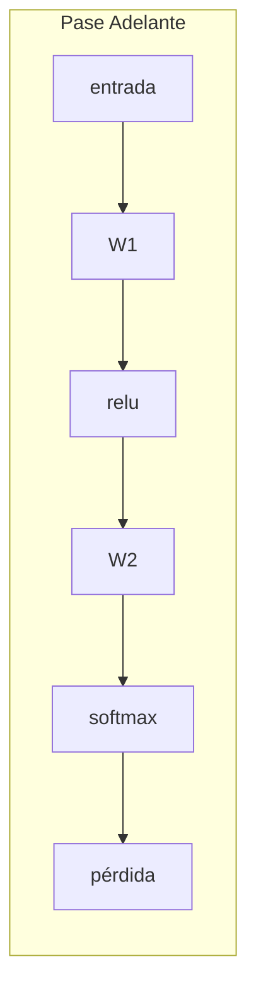
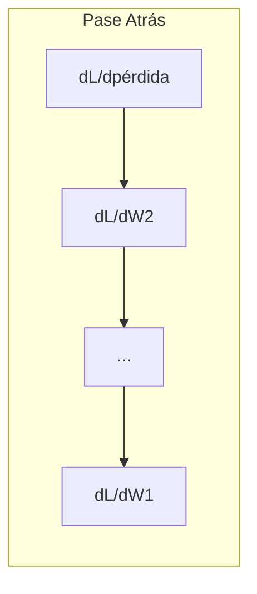

# Cálculo para Machine Learning

> Las derivadas te dicen cuál es el camino cuesta abajo. Eso es todo lo que necesita una red neuronal para aprender.

**Tipo:** Aprender
**Lenguaje:** Python
**Prerrequisitos:** Fase 1, Lecciones 01–03
**Tiempo:** ~60 minutos

## Objetivos de aprendizaje

- Calcular derivadas numéricas y analíticas para funciones comunes de ML ($x^2$, sigmoide, entropía cruzada)
- Implementar descenso de gradiente desde cero para minimizar una función de pérdida en 1D y 2D
- Derivar el gradiente de un modelo de regresión lineal y entrenarlo mediante actualizaciones manuales de pesos
- Explicar la matriz Hessiana, las aproximaciones por series de Taylor y su conexión con los métodos de optimización

---

## El problema

Tienes una red neuronal con millones de pesos. Cada peso es una perilla. Necesitas descubrir en qué dirección girar cada perilla para que el modelo sea ligeramente menos incorrecto. El cálculo te da esa dirección.

Sin cálculo, entrenar una red neuronal significaría probar cambios al azar y esperar lo mejor. Con derivadas, sabes exactamente cómo afecta cada peso al error. Giras cada perilla en la dirección correcta, en cada paso.

---

## El concepto

### ¿Qué es una derivada?

Una derivada mide la tasa de cambio. Para una función $y = f(x)$, la derivada $f'(x)$ te dice: si empujas $x$ una cantidad infinitesimal, ¿cuánto cambia $y$?

Geométricamente, la derivada es la pendiente de la recta tangente en un punto.

**$f(x) = x^2$:**

| $x$ | $f(x)$ | $f'(x)$ (pendiente) |
|-----|--------|---------------------|
| 0   | 0      | 0 (plano, en el fondo)              |
| 1   | 1      | 2                   |
| 2   | 4      | 4 (pendiente de la tangente en este punto) |
| 3   | 9      | 6                   |

En $x=2$, la pendiente es 4. Si mueves $x$ un poco hacia la derecha, $y$ aumenta aproximadamente 4 veces esa cantidad. En $x=0$, la pendiente es 0: estás en el fondo del cuenco.

La definición formal:

$$f'(x) = \lim_{h \to 0} \frac{f(x + h) - f(x)}{h}$$

En código, omites el límite y usas un $h$ muy pequeño. Esa es la derivada numérica.

---

### Derivadas parciales: una variable a la vez

Las funciones reales tienen muchas entradas. La pérdida de una red neuronal depende de miles de pesos. Una derivada parcial mantiene todas las variables constantes excepto una, y luego toma la derivada respecto a esa única variable.

$$f(x, y) = x^2 + 3xy + y^2$$

$$\frac{\partial f}{\partial x} = 2x + 3y \quad \text{(tratar } y \text{ como constante)}$$

$$\frac{\partial f}{\partial y} = 3x + 2y \quad \text{(tratar } x \text{ como constante)}$$

Cada derivada parcial responde: si solo empujo este peso, ¿cómo cambia la pérdida?

---

### El gradiente: vector de todas las derivadas parciales

El gradiente reúne todas las derivadas parciales en un vector. Para una función $f(x, y, z)$, el gradiente es:

$$\nabla f = \left[\frac{\partial f}{\partial x},\ \frac{\partial f}{\partial y},\ \frac{\partial f}{\partial z}\right]$$

El gradiente apunta en la dirección de mayor ascenso. Para minimizar una función, avanza en la dirección opuesta.

**Mapa de contornos de $f(x,y) = x^2 + y^2$:**

La función forma un cuenco con círculos concéntricos como líneas de nivel. El mínimo está en $(0, 0)$.

| Punto  | $\nabla f$                                  | $-\nabla f$ (dirección de descenso)          |
|--------|---------------------------------------------|----------------------------------------------|
| (1, 1) | [2, 2] (apunta cuesta arriba, alejándose del mínimo) | [-2, -2] (apunta cuesta abajo, hacia el mínimo) |
| (0, 0) | [0, 0] (plano, en el mínimo)                | [0, 0]                                        |

Esto es el descenso de gradiente ilustrado. Calcula el gradiente, niégalo, da un paso.

---

### La conexión con la optimización

Entrenar una red neuronal es un problema de optimización. Tienes una función de pérdida $L(w_1, w_2, \ldots, w_n)$ que mide cuán equivocado está el modelo. Quieres minimizarla.

**Regla de actualización del descenso de gradiente:**

$$w_{\text{nuevo}} = w_{\text{viejo}} - \alpha \cdot \frac{\partial L}{\partial w}$$

Para cada peso:
1. Calcula la derivada parcial de la pérdida respecto a ese peso
2. Réstale un pequeño múltiplo al peso
3. Repite

La tasa de aprendizaje $\alpha$ controla el tamaño del paso. Demasiado grande y te pasas. Demasiado pequeño y avanzas muy lento.

**Paisaje de pérdida (corte 1D):**

| Característica | Descripción |
|----------------|-------------|
| Mínimo global   | El punto más bajo de toda la curva — la mejor solución |
| Mínimo local    | Un valle más bajo que sus vecinos, pero no el más bajo en general |
| Pendiente       | El descenso de gradiente sigue la pendiente cuesta abajo desde cualquier punto de inicio |

El descenso de gradiente puede quedar atrapado en mínimos locales, pero en espacios de alta dimensión (millones de pesos) esto rara vez es un problema práctico.

---

### Derivadas numéricas vs. analíticas

Hay dos formas de calcular una derivada.

**Analítica:** aplicar reglas de cálculo a mano. Para $f(x) = x^2$, la derivada es $f'(x) = 2x$. Exacta. Rápida.

**Numérica:** aproximar usando la definición. Calcula $f(x+h)$ y $f(x-h)$ para un $h$ pequeño, luego usa la diferencia.

**Diferencia central (numérica):**

$$f'(x) \approx \frac{f(x + h) - f(x - h)}{2h}$$

$h = 0.0001$ funciona bien en la práctica.

Las derivadas numéricas son más lentas pero funcionan para cualquier función. Las analíticas son rápidas pero requieren derivar la fórmula. Los frameworks de redes neuronales usan un tercer enfoque: diferenciación automática, que calcula derivadas exactas de forma mecánica. Verás eso en la Fase 3.

---

### Derivadas a mano para funciones simples

Estas son las derivadas que verás una y otra vez en ML.

| Función | Derivada | Uso en ML |
|---------|----------|-----------|
| $f(x) = x^2$           | $f'(x) = 2x$              | Funciones de pérdida (MSE) |
| $f(x) = wx + b$        | $f'(w) = x$               | Capa lineal (gradiente respecto a $w$) |
|                        | $f'(b) = 1$               | Capa lineal (gradiente respecto a $b$) |
|                        | $f'(x) = w$               | Capa lineal (gradiente respecto a $x$) |
| $f(x) = e^x$           | $f'(x) = e^x$             | Softmax, atención |
| $f(x) = \ln(x)$        | $f'(x) = 1/x$             | Pérdida de entropía cruzada |
| $f(x) = \frac{1}{1+e^{-x}}$ | $f'(x) = f(x)(1-f(x))$ | Activación sigmoide |

Para $f(x) = x^2$:

| $x$  | $f(x)$ | $f'(x)$ | significado |
|------|--------|---------|-------------|
| $-2$ | 4      | $-4$    | pendiente hacia la izquierda (decreciente) |
| $-1$ | 1      | $-2$    | pendiente hacia la izquierda (decreciente) |
| $0$  | 0      | $0$     | plano (¡mínimo!) |
| $1$  | 1      | $2$     | pendiente hacia la derecha (creciente) |
| $2$  | 4      | $4$     | pendiente hacia la derecha (creciente) |

Para $f(w) = wx + b$ con $x=3$, $b=1$:

$$f(w) = 3w + 1 \qquad f'(w) = 3$$

La derivada respecto a $w$ es simplemente $x$. Si $x$ es grande, un pequeño cambio en $w$ produce un gran cambio en la salida.

---

### La regla de la cadena

Cuando las funciones están compuestas, la regla de la cadena indica cómo diferenciarlas.

$$\text{Si } y = f(g(x)),\ \text{ entonces } \frac{dy}{dx} = f'(g(x)) \cdot g'(x)$$

**Ejemplo:** $y = (3x + 1)^2$

- exterior: $f(u) = u^2$, $f'(u) = 2u$
- interior: $g(x) = 3x + 1$, $g'(x) = 3$
- $\dfrac{dy}{dx} = 2(3x + 1) \cdot 3 = 6(3x + 1)$

Las redes neuronales son cadenas de funciones: entrada → lineal → activación → lineal → activación → pérdida. La retropropagación es la regla de la cadena aplicada repetidamente de la salida a la entrada. Ese es el algoritmo completo.

---

### La Matriz Hessiana

El gradiente te dice la pendiente. La Hessiana te dice la curvatura.

La Hessiana es la matriz de derivadas parciales de segundo orden. Para una función $f(x_1, x_2, \ldots, x_n)$, la entrada $(i, j)$ de la Hessiana es:

$$H[i][j] = \frac{\partial^2 f}{\partial x_i \, \partial x_j}$$

Para una función de 2 variables $f(x, y)$:

$$H = \begin{pmatrix} \dfrac{\partial^2 f}{\partial x^2} & \dfrac{\partial^2 f}{\partial x \partial y} \\ \dfrac{\partial^2 f}{\partial y \partial x} & \dfrac{\partial^2 f}{\partial y^2} \end{pmatrix}$$

**Lo que la Hessiana te dice en un punto crítico (donde el gradiente = 0):**

| Propiedad de la Hessiana | Significado | Superficie de ejemplo |
|--------------------------|-------------|----------------------|
| Definida positiva (todos los autovalores > 0) | Mínimo local | Cuenco apuntando hacia arriba |
| Definida negativa (todos los autovalores < 0) | Máximo local | Cuenco apuntando hacia abajo |
| Indefinida (autovalores mixtos) | Punto de silla | Forma de silla de montar |

**Ejemplo:** $f(x, y) = x^2 - y^2$ (función de punto de silla)

$$\frac{\partial f}{\partial x} = 2x \qquad \frac{\partial f}{\partial y} = -2y$$

$$\frac{\partial^2 f}{\partial x^2} = 2 \qquad \frac{\partial^2 f}{\partial y^2} = -2 \qquad \frac{\partial^2 f}{\partial x \partial y} = 0$$

$$H = \begin{pmatrix} 2 & 0 \\ 0 & -2 \end{pmatrix}$$

Autovalores: $2$ y $-2$ (uno positivo, uno negativo) → **punto de silla en $(0, 0)$**

Comparar con $f(x, y) = x^2 + y^2$ (cuenco):

$$H = \begin{pmatrix} 2 & 0 \\ 0 & 2 \end{pmatrix}$$

Autovalores: $2$ y $2$ (ambos positivos) → **mínimo local en $(0, 0)$**

**Por qué importa la Hessiana en ML:**

El método de Newton usa la Hessiana para dar mejores pasos de optimización que el descenso de gradiente. En lugar de solo seguir la pendiente, tiene en cuenta la curvatura:

$$w_{\text{nuevo}} = w_{\text{viejo}} - H^{-1} \cdot \nabla f \quad \text{(Newton)}$$

$$w_{\text{nuevo}} = w_{\text{viejo}} - \alpha \cdot \nabla f \quad \text{(descenso de gradiente)}$$

El método de Newton converge más rápido porque la Hessiana "reescala" el gradiente: las direcciones empinadas dan pasos más pequeños, las direcciones planas dan pasos más grandes.

La trampa: para una red neuronal con $N$ parámetros, la Hessiana es $N \times N$. Un modelo con 1 millón de parámetros necesitaría una matriz de 1 billón de entradas. Por eso usamos aproximaciones.

| Método | Qué usa | Costo | Convergencia |
|--------|---------|-------|--------------|
| Descenso de gradiente | Solo primeras derivadas | $O(N)$ por paso | Lenta (lineal) |
| Método de Newton | Hessiana completa | $O(N^3)$ por paso | Rápida (cuadrática) |
| L-BFGS | Hessiana aproximada desde historial de gradientes | $O(N)$ por paso | Media (superlineal) |
| Adam | Tasas adaptativas por parámetro (aprox. diagonal de Hessiana) | $O(N)$ por paso | Media |
| Gradiente natural | Matriz de información de Fisher (Hessiana estadística) | $O(N^2)$ por paso | Rápida |

En la práctica, Adam es el optimizador predeterminado para deep learning. Aproxima información de segundo orden de forma barata rastreando la media y varianza acumuladas de los gradientes por parámetro.

---

### Series de Taylor

Cualquier función suave puede aproximarse localmente mediante un polinomio:

$$f(x + h) = f(x) + f'(x) \cdot h + \frac{1}{2}f''(x) \cdot h^2 + \frac{1}{6}f'''(x) \cdot h^3 + \cdots$$

Cuantos más términos incluyas, mejor es la aproximación, pero solo cerca del punto $x$.

**Por qué importan las series de Taylor en ML:**

- **Taylor de primer orden = descenso de gradiente.** Cuando usas $f(x + h) \approx f(x) + f'(x) \cdot h$, estás haciendo una aproximación lineal. El descenso de gradiente minimiza este modelo lineal eligiendo $h = -\alpha \cdot f'(x)$.

- **Taylor de segundo orden = método de Newton.** Usando $f(x + h) \approx f(x) + f'(x) \cdot h + \frac{1}{2}f''(x) \cdot h^2$, obtienes un modelo cuadrático. Minimizarlo da $h = -f'(x)/f''(x)$: el paso de Newton.

- **Diseño de funciones de pérdida.** El MSE y la entropía cruzada son suaves, lo que significa que sus expansiones de Taylor se comportan bien. Esto no es accidental: las pérdidas suaves hacen que la optimización sea predecible.

| Orden de aproximación | Qué captura | Método de optimización |
|-----------------------|-------------|------------------------|
| 0° (constante) | Solo el valor | Búsqueda aleatoria |
| 1° (lineal)    | Pendiente   | Descenso de gradiente |
| 2° (cuadrático)| Curvatura   | Método de Newton |
| Órdenes superiores | Estructura más fina | Rara vez usados en ML |

La idea clave: toda la optimización basada en gradientes consiste en aproximar localmente la función de pérdida y avanzar hacia el mínimo de esa aproximación.

---

### Integrales en ML

Las derivadas te dicen tasas de cambio. Las integrales calculan acumulaciones — el área bajo una curva.

En ML rara vez calculas integrales a mano, pero el concepto está en todas partes:

**Probabilidad.** Para una variable aleatoria continua con densidad $p(x)$:

$$P(a < X < b) = \int_a^b p(x)\, dx$$

El área bajo la curva de densidad de probabilidad entre $a$ y $b$ es la probabilidad de caer en ese rango.

**Valor esperado.** El resultado promedio ponderado por probabilidad:

$$\mathbb{E}[f(X)] = \int f(x) \cdot p(x)\, dx$$

La pérdida esperada sobre una distribución de datos es una integral. El entrenamiento minimiza una aproximación empírica de ella.

**Divergencia KL.** Mide cuán diferentes son dos distribuciones:

$$KL(p \| q) = \int p(x) \cdot \log\frac{p(x)}{q(x)}\, dx$$

Usada en VAEs, destilación de conocimiento e inferencia bayesiana.

**Constantes de normalización.** En inferencia bayesiana:

$$p(w \mid \text{datos}) = \frac{p(\text{datos} \mid w) \cdot p(w)}{\int p(\text{datos} \mid w) \cdot p(w)\, dw}$$

El denominador es una integral sobre todos los valores posibles de los parámetros. Suele ser intratable, por eso usamos aproximaciones como MCMC e inferencia variacional.

| Concepto integral | Dónde aparece en ML |
|-------------------|---------------------|
| Área bajo la curva | Probabilidad desde funciones de densidad |
| Valor esperado | Funciones de pérdida, minimización del riesgo |
| Divergencia KL | VAEs, optimización de políticas, destilación |
| Normalización | Posteriors bayesianas, denominador de softmax |
| Verosimilitud marginal | Comparación de modelos, cota inferior de evidencia (ELBO) |

---

### Regla de la cadena multivariable en un grafo computacional

La regla de la cadena no solo aplica a funciones escalares en línea. En una red neuronal, las variables se ramifican y se fusionan. Así fluyen las derivadas en un pase hacia adelante simple:



El pase hacia atrás calcula gradientes de derecha a izquierda:



Cada flecha multiplica por la derivada local. El gradiente de cualquier parámetro es el producto de todas las derivadas locales a lo largo del camino desde la pérdida hasta ese parámetro. Cuando los caminos se ramifican y se unen, se suman las contribuciones (regla de la cadena multivariable).

Eso es todo lo que es la retropropagación: la regla de la cadena aplicada sistemáticamente a través de un grafo computacional, de la salida a las entradas.

---

### La matriz Jacobiana

Cuando una función mapea un vector a un vector (como una capa de red neuronal), su derivada es una matriz. El Jacobiano contiene todas las derivadas parciales de cada salida respecto a cada entrada.

Para $f: \mathbb{R}^n \to \mathbb{R}^m$, el Jacobiano $J$ es una matriz $m \times n$:

| | $x_1$ | $x_2$ | $\cdots$ | $x_n$ |
|---|---|---|---|---|
| $f_1$ | $\partial f_1/\partial x_1$ | $\partial f_1/\partial x_2$ | $\cdots$ | $\partial f_1/\partial x_n$ |
| $f_2$ | $\partial f_2/\partial x_1$ | $\partial f_2/\partial x_2$ | $\cdots$ | $\partial f_2/\partial x_n$ |
| $\vdots$ | $\vdots$ | $\vdots$ | $\vdots$ | $\vdots$ |
| $f_m$ | $\partial f_m/\partial x_1$ | $\partial f_m/\partial x_2$ | $\cdots$ | $\partial f_m/\partial x_n$ |

No calcularás Jacobianos a mano para redes neuronales — PyTorch lo maneja. Pero saber que existe ayuda a entender las formas en la retropropagación: si una capa mapea $\mathbb{R}^n$ a $\mathbb{R}^m$, su Jacobiano es $m \times n$. El gradiente fluye hacia atrás a través de la transpuesta de esta matriz.

---

### Por qué esto importa para las redes neuronales

Cada peso en una red neuronal recibe un gradiente. El gradiente te dice cómo ajustar ese peso para reducir la pérdida.





Cada actualización de peso:
- $W_1 = W_1 - \alpha \cdot \dfrac{\partial L}{\partial W_1}$
- $W_2 = W_2 - \alpha \cdot \dfrac{\partial L}{\partial W_2}$

El pase hacia adelante calcula la predicción y la pérdida. El pase hacia atrás calcula el gradiente de la pérdida respecto a cada peso. Luego cada peso da un pequeño paso cuesta abajo. Repite durante millones de pasos. Eso es el deep learning.

---

## Constrúyelo

### Paso 1: Derivada numérica desde cero

```python
def numerical_derivative(f, x, h=1e-7):
    return (f(x + h) - f(x - h)) / (2 * h)

def f(x):
    return x ** 2

for x in [-2, -1, 0, 1, 2]:
    numerical = numerical_derivative(f, x)
    analytical = 2 * x
    print(f"x={x:2d}  f'(x) numérica={numerical:.6f}  analítica={analytical:.1f}")
```

La derivada numérica coincide con la analítica hasta muchos decimales.

### Paso 2: Derivadas parciales y gradientes

```python
def numerical_gradient(f, point, h=1e-7):
    gradient = []
    for i in range(len(point)):
        point_plus = list(point)
        point_minus = list(point)
        point_plus[i] += h
        point_minus[i] -= h
        partial = (f(point_plus) - f(point_minus)) / (2 * h)
        gradient.append(partial)
    return gradient

def f_multi(point):
    x, y = point
    return x**2 + 3*x*y + y**2

grad = numerical_gradient(f_multi, [1.0, 2.0])
print(f"Gradiente numérico en (1,2): {[f'{g:.4f}' for g in grad]}")
print(f"Gradiente analítico en (1,2): [2*1+3*2, 3*1+2*2] = [{2*1+3*2}, {3*1+2*2}]")
```

### Paso 3: Descenso de gradiente para encontrar el mínimo de $f(x) = x^2$

```python
x = 5.0
lr = 0.1
for step in range(20):
    grad = 2 * x
    x = x - lr * grad
    print(f"step {step:2d}  x={x:8.4f}  f(x)={x**2:10.6f}")
```

Comenzando en $x=5$, cada paso se acerca más a $x=0$ (el mínimo).

### Paso 4: Descenso de gradiente en función 2D

```python
def f_2d(point):
    x, y = point
    return x**2 + y**2

point = [4.0, 3.0]
lr = 0.1
for step in range(30):
    grad = numerical_gradient(f_2d, point)
    point = [p - lr * g for p, g in zip(point, grad)]
    loss = f_2d(point)
    if step % 5 == 0 or step == 29:
        print(f"step {step:2d}  point=({point[0]:7.4f}, {point[1]:7.4f})  f={loss:.6f}")
```

### Paso 5: Comparando derivadas numéricas y analíticas

```python
import math

test_functions = [
    ("x^2",      lambda x: x**2,          lambda x: 2*x),
    ("x^3",      lambda x: x**3,          lambda x: 3*x**2),
    ("sin(x)",   lambda x: math.sin(x),   lambda x: math.cos(x)),
    ("e^x",      lambda x: math.exp(x),   lambda x: math.exp(x)),
    ("1/x",      lambda x: 1/x,           lambda x: -1/x**2),
]

x = 2.0
print(f"{'Función':<12} {'Numérica':>12} {'Analítica':>12} {'Error':>12}")
print("-" * 50)
for name, f, df in test_functions:
    num = numerical_derivative(f, x)
    ana = df(x)
    err = abs(num - ana)
    print(f"{name:<12} {num:12.6f} {ana:12.6f} {err:12.2e}")
```

### Paso 6: Calculando la Hessiana numéricamente

```python
def hessian_2d(f, x, y, h=1e-5):
    fxx = (f(x + h, y) - 2 * f(x, y) + f(x - h, y)) / (h ** 2)
    fyy = (f(x, y + h) - 2 * f(x, y) + f(x, y - h)) / (h ** 2)
    fxy = (f(x + h, y + h) - f(x + h, y - h) - f(x - h, y + h) + f(x - h, y - h)) / (4 * h ** 2)
    return [[fxx, fxy], [fxy, fyy]]

def saddle(x, y):
    return x ** 2 - y ** 2

def bowl(x, y):
    return x ** 2 + y ** 2

H_saddle = hessian_2d(saddle, 0.0, 0.0)
H_bowl = hessian_2d(bowl, 0.0, 0.0)
print(f"Hessiana de silla: {H_saddle}")  # [[2, 0], [0, -2]] -- signos mixtos
print(f"Hessiana de cuenco: {H_bowl}")  # [[2, 0], [0, 2]]  -- ambos positivos
```

La Hessiana de la función de silla tiene autovalores 2 y −2 (signos mixtos → punto de silla). El cuenco tiene autovalores 2 y 2 (ambos positivos → mínimo).

### Paso 7: Serie de Taylor en acción

```python
import math

def taylor_approx(f, f_prime, f_double_prime, x0, h, order=2):
    result = f(x0)
    if order >= 1:
        result += f_prime(x0) * h
    if order >= 2:
        result += 0.5 * f_double_prime(x0) * h ** 2
    return result

x0 = 0.0
for h in [0.1, 0.5, 1.0, 2.0]:
    true_val = math.sin(h)
    t1 = taylor_approx(math.sin, math.cos, lambda x: -math.sin(x), x0, h, order=1)
    t2 = taylor_approx(math.sin, math.cos, lambda x: -math.sin(x), x0, h, order=2)
    print(f"h={h:.1f}  sin(h)={true_val:.4f}  orden1={t1:.4f}  orden2={t2:.4f}")
```

Cerca de $x_0=0$, $\sin(x) \approx x$ (Taylor de primer orden). La aproximación es excelente para $h$ pequeño pero se desintegra para $h$ grande. Por eso el descenso de gradiente funciona mejor con tasas de aprendizaje pequeñas: cada paso asume que la aproximación lineal es precisa.

### Paso 8: Por qué esto importa para una red neuronal

```python
import random

random.seed(42)

w = random.gauss(0, 1)
b = random.gauss(0, 1)
lr = 0.01

xs = [1.0, 2.0, 3.0, 4.0, 5.0]
ys = [3.0, 5.0, 7.0, 9.0, 11.0]

for epoch in range(200):
    total_loss = 0
    dw = 0
    db = 0
    for x, y in zip(xs, ys):
        pred = w * x + b
        error = pred - y
        total_loss += error ** 2
        dw += 2 * error * x
        db += 2 * error
    dw /= len(xs)
    db /= len(xs)
    total_loss /= len(xs)
    w -= lr * dw
    b -= lr * db
    if epoch % 40 == 0 or epoch == 199:
        print(f"epoch {epoch:3d}  w={w:.4f}  b={b:.4f}  loss={total_loss:.6f}")

print(f"\nAprendido: y = {w:.2f}x + {b:.2f}")
print(f"Real:      y = 2x + 1")
```

Cada bucle de entrenamiento basado en gradientes sigue este patrón: predice, calcula la pérdida, calcula los gradientes, actualiza los pesos.

---

## Úsalo con NumPy

Con NumPy, las mismas operaciones son más rápidas y concisas:

```python
import numpy as np

x = np.array([1, 2, 3, 4, 5], dtype=float)
y = np.array([3, 5, 7, 9, 11], dtype=float)

w, b = np.random.randn(), np.random.randn()
lr = 0.01

for epoch in range(200):
    pred = w * x + b
    error = pred - y
    loss = np.mean(error ** 2)
    dw = np.mean(2 * error * x)
    db = np.mean(2 * error)
    w -= lr * dw
    b -= lr * db

print(f"Aprendido: y = {w:.2f}x + {b:.2f}")
```

Acabas de construir descenso de gradiente desde cero. PyTorch automatiza el cálculo de gradientes, pero el bucle de actualización es idéntico.

---

## Ejercicios

1. Implementa `numerical_second_derivative(f, x)` usando `numerical_derivative` llamada dos veces. Verifica que la segunda derivada de $x^3$ en $x=2$ es 12.
2. Usa descenso de gradiente para encontrar el mínimo de $f(x, y) = (x - 3)^2 + (y + 1)^2$. Empieza desde $(0, 0)$. La respuesta debería converger a $(3, -1)$.
3. Agrega momento al bucle de descenso de gradiente: mantén un vector de velocidad que acumule gradientes pasados. Compara la velocidad de convergencia con y sin momento en $f(x) = x^4 - 3x^2$.

---

## Términos clave

| Término | Lo que la gente dice | Lo que realmente significa |
|---------|---------------------|---------------------------|
| Derivada | "La pendiente" | La tasa de cambio de una función en un punto. Te dice cuánto cambia la salida por unidad de cambio en la entrada. |
| Derivada parcial | "Derivada de una variable" | La derivada respecto a una variable mientras todas las demás se mantienen constantes. |
| Gradiente | "Dirección de mayor ascenso" | Un vector de todas las derivadas parciales. Apunta en la dirección que aumenta la función más rápido. |
| Descenso de gradiente | "Ve cuesta abajo" | Resta el gradiente (por una tasa de aprendizaje) de los parámetros para reducir la pérdida. El núcleo del entrenamiento de redes neuronales. |
| Tasa de aprendizaje | "Tamaño del paso" | Un escalar que controla qué tan grande es cada paso de descenso de gradiente. Demasiado grande: diverge. Demasiado pequeño: converge lento. |
| Regla de la cadena | "Multiplica las derivadas" | La regla para diferenciar funciones compuestas: $df/dx = (df/dg) \cdot (dg/dx)$. La base matemática de la retropropagación. |
| Jacobiano | "Matriz de derivadas" | Cuando una función mapea vectores a vectores, el Jacobiano es la matriz de todas las derivadas parciales de las salidas respecto a las entradas. |
| Derivada numérica | "Diferencias finitas" | Aproximar una derivada evaluando la función en dos puntos cercanos y calculando la pendiente entre ellos. |
| Retropropagación | "Autodiff en modo reverso" | Calcular gradientes capa por capa de la salida a la entrada usando la regla de la cadena. Cómo aprenden las redes neuronales. |
| Hessiana | "Matriz de segundas derivadas" | La matriz de todas las derivadas parciales de segundo orden. Describe la curvatura de una función. Hessiana definida positiva en un punto crítico significa mínimo local. |
| Serie de Taylor | "Aproximación polinomial" | Aproximar una función cerca de un punto usando sus derivadas: $f(x+h) \approx f(x) + f'(x)h + \frac{1}{2}f''(x)h^2 + \cdots$. La base para entender por qué funcionan el descenso de gradiente y el método de Newton. |
| Integral | "Área bajo la curva" | La acumulación de una cantidad sobre un rango. En ML, las integrales definen probabilidades, valores esperados y divergencia KL. |

---

## Lecturas adicionales

- [3Blue1Brown: La esencia del cálculo](https://www.3blue1brown.com/topics/calculus) — intuición visual para derivadas, integrales y la regla de la cadena
- [Stanford CS231n: Retropropagación](https://cs231n.github.io/optimization-2/) — cómo fluyen los gradientes a través de las capas de redes neuronales
